# 基于springboot的中药实验管理系统

---
### 👉作者QQ ：1556708905 微信：zheng0123Long (支持定制修改、部署调试、定制毕设)

### 👉接网站建设、小程序、H5、APP、各种系统等

---

#### 介绍

我开发的基于Spring Boot的中药实验管理系统旨在提升中药学教学和实验管理的效率和质量。系统通过整合实验教学、在线学习、实验预约和评分等功能，提供了一个全面、便捷的教学和实验管理平台。系统支持管理员、教师、实验员和学生四种角色，各角色具备相应的权限和功能模块，能够满足不同用户的需求和管理要求。

#### 技术栈

后端技术栈：Springboot+Mysql+Maven

前端技术栈：Vue+Html+Css+Javascript+ElementUI

开发工具：Idea+Vscode+Navicate

#### 系统功能介绍

管理员角色功能模块  
个人中心：管理员可以管理个人信息，包括修改密码、更新联系方式等，确保管理员个人信息的准确性和安全性。  
学生管理：管理员可以添加、修改和删除学生信息，分配实验任务，查看学生的实验进度和成绩。  
教师管理：管理员可以管理教师的信息，分配实验教学任务，查看教师的教学情况和学生反馈。  
实验员管理：管理员可以管理实验员的信息，分配实验管理任务，确保实验设备和材料的准备和维护。  
实验教学管理：管理员可以制定和管理实验教学计划，安排实验课程，确保实验教学的顺利进行。  
在线学习管理：管理员可以管理在线学习资源，上传和更新学习资料，提供学生在线学习的支持。  
实验信息管理：管理员可以录入和管理实验的详细信息，包括实验内容、实验步骤、实验结果等。  
实验预约管理：管理员可以设置实验预约规则，审核和管理学生的实验预约请求。  
实验指导管理：管理员可以分配实验指导任务，监督实验指导过程，确保实验的规范性和安全性。  
实验评分管理：管理员可以制定实验评分标准，审核和管理教师和实验员的评分情况，确保评分的公平性和准确性。  
器材信息管理：管理员可以管理实验器材的信息，包括器材的采购、维护和库存情况，确保实验器材的充足和良好状态。  
自由讨论：管理员可以管理系统内的讨论区，监督讨论内容，促进教师、实验员和学生之间的交流和互动。  
系统管理：管理员可以进行系统的整体管理和维护，包括系统设置、权限管理、日志记录等，确保系统的稳定运行和安全。  

教师角色功能模块  
实验教学：教师可以查看和管理分配给自己的实验教学任务，准备实验教学资料，安排实验课程。  
在线学习：教师可以管理在线学习资源，上传和更新学习资料，指导学生进行在线学习。  
实验信息：教师可以查看和管理实验的详细信息，包括实验内容、实验步骤、实验结果等。  
自由讨论：教师可以参与系统内的讨论区，回答学生的问题，分享实验经验和心得。  
个人中心：教师可以管理个人信息，包括修改密码、更新联系方式等，确保个人信息的准确性和安全性。  
后台管理：  
实验教学管理：教师可以协助管理员管理实验教学计划，安排实验课程，确保实验教学的顺利进行。  
在线学习管理：教师可以协助管理员管理在线学习资源，上传和更新学习资料，提供学生在线学习的支持。  
实验信息管理：教师可以录入和管理实验的详细信息，包括实验内容、实验步骤、实验结果等。  
实验预约管理：教师可以查看和管理学生的实验预约请求，安排实验时间和地点。  
实验指导管理：教师可以指导学生进行实验，监督实验过程，确保实验的规范性和安全性。  
实验评分管理：教师可以按照评分标准对学生的实验进行评分，提供评分反馈，确保评分的公平性和准确性。  

实验员角色功能模块  
实验教学：实验员可以协助教师进行实验教学，准备实验材料和设备，确保实验顺利进行。  
在线学习：实验员可以管理在线学习资源，上传和更新学习资料，指导学生进行在线学习。  
实验信息：实验员可以查看和管理实验的详细信息，包括实验内容、实验步骤、实验结果等。  
自由讨论：实验员可以参与系统内的讨论区，回答学生的问题，分享实验经验和心得。  
个人中心：实验员可以管理个人信息，包括修改密码、更新联系方式等，确保个人信息的准确性和安全性。  
后台管理：
实验预约管理：实验员可以查看和管理学生的实验预约请求，安排实验时间和地点。  
实验指导管理：实验员可以指导学生进行实验，监督实验过程，确保实验的规范性和安全性。  
实验评分管理：实验员可以按照评分标准对学生的实验进行评分，提供评分反馈，确保评分的公平性和准确性。  
器材信息管理：实验员可以管理实验器材的信息，包括器材的采购、维护和库存情况，确保实验器材的充足和良好状态。  

学生角色功能模块  
实验教学：学生可以查看实验教学安排，学习实验内容和步骤，参与实验课程。  
在线学习：学生可以访问在线学习资源，下载学习资料，进行自主学习。  
实验信息：学生可以查看实验的详细信息，包括实验内容、实验步骤、实验结果等。  
自由讨论：学生可以参与系统内的讨论区，提出问题，分享实验心得和经验。  
个人中心：学生可以管理个人信息，包括修改密码、更新联系方式等，确保个人信息的准确性和安全性。  
后台管理：  
实验预约管理：学生可以提交实验预约请求，查看预约状态，安排实验时间。  
实验指导管理：学生可以查看实验指导信息，接受教师和实验员的指导，完成实验任务。  
实验评分管理：学生可以查看实验评分和反馈，了解自己的实验成绩和表现。  
我的收藏管理：学生可以收藏重要的实验资料和信息，方便日后查阅和学习。  

#### 系统作用

该中药实验管理系统的主要作用包括：  

提高实验教学效率：通过在线管理实验教学计划和资源，简化了实验教学的组织和管理过程，提高了实验教学的效率。  
增强实验管理规范性：通过严格的实验预约和指导流程，确保了实验过程的规范性和安全性。  
促进师生互动：通过系统内的讨论区和在线学习资源，促进了教师、实验员和学生之间的交流和互动，提升了教学效果。  
提供全面的实验评价：通过详细的实验评分和反馈，帮助学生了解自己的实验表现，改进实验技能和知识。  
保障实验资源的充分利用：通过精细的实验器材管理，确保实验设备和材料的充足和良好状态，保障实验顺利进行。  

#### 系统功能截图

代码结构

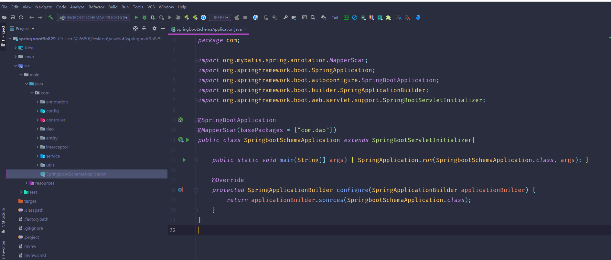

数据库表

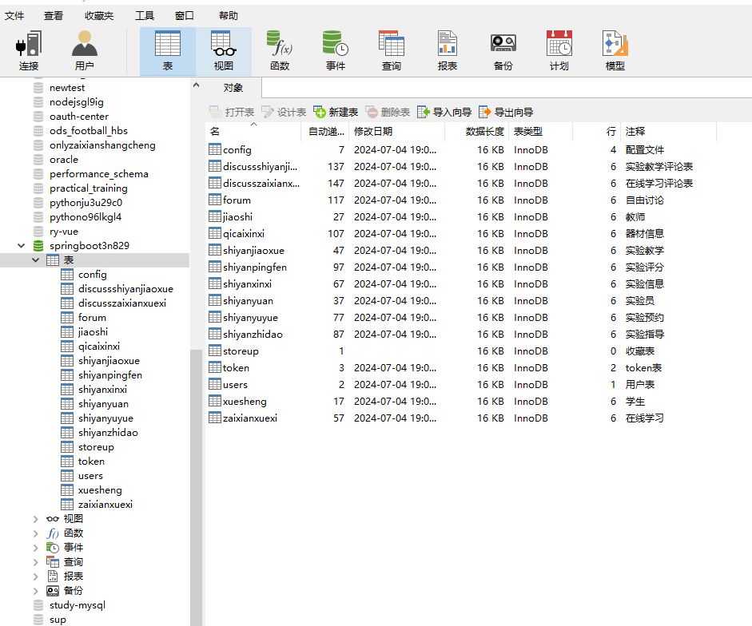

登录

教师管理

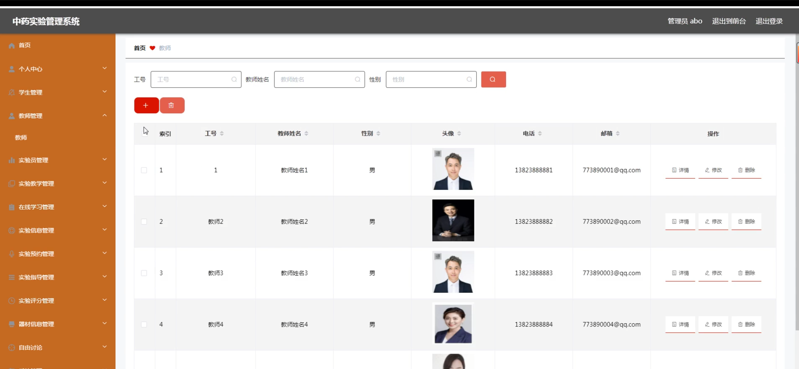

实验员管理

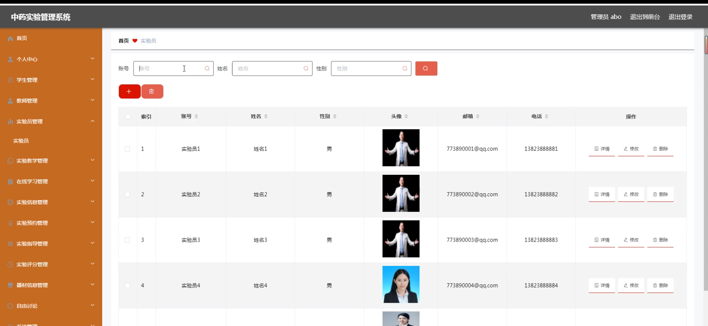

实验信息管理

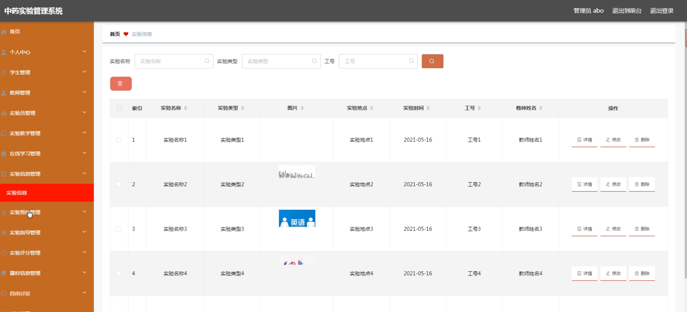

系统管理

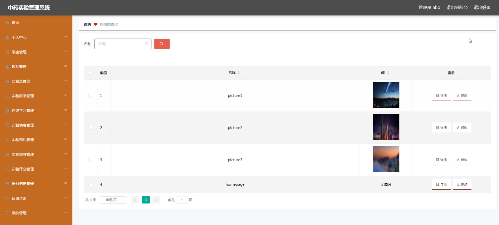

教师端实验教学管理

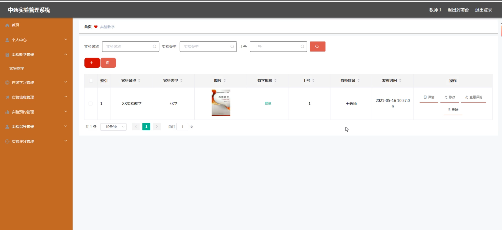

前台页面首页

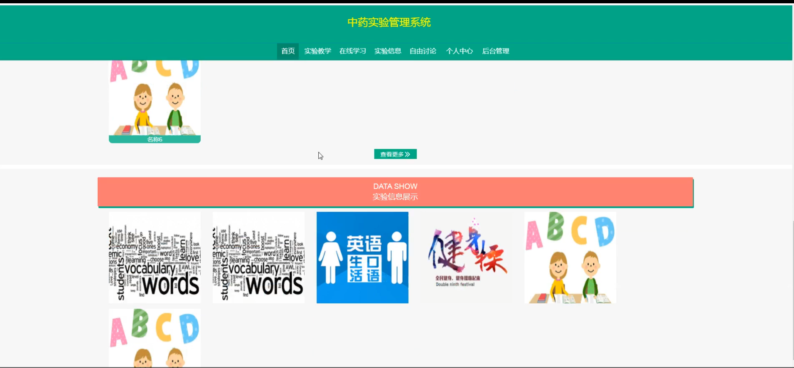

个人中心

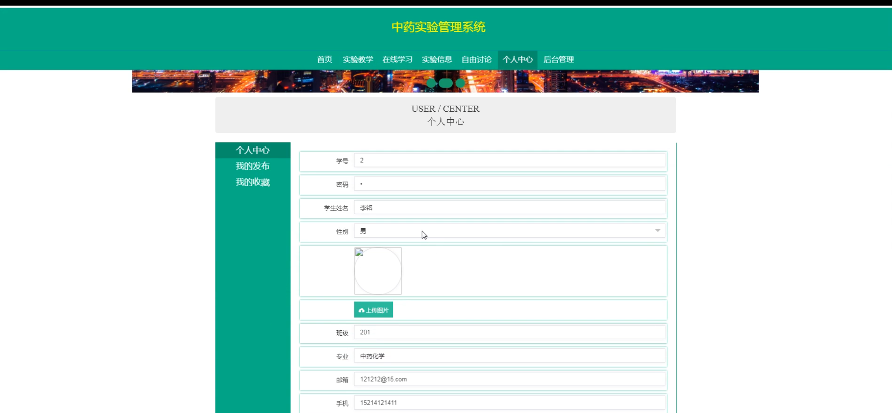

实验教学

实验信息

自由讨论

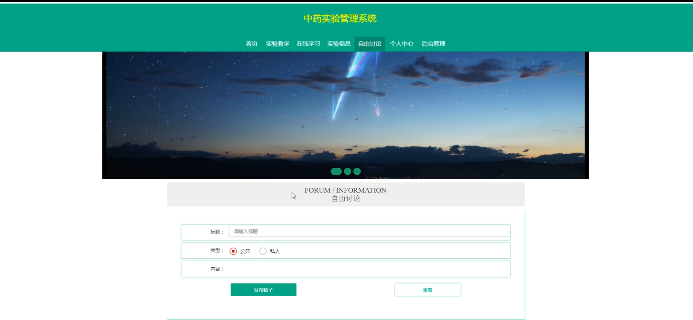

学生端后台管理

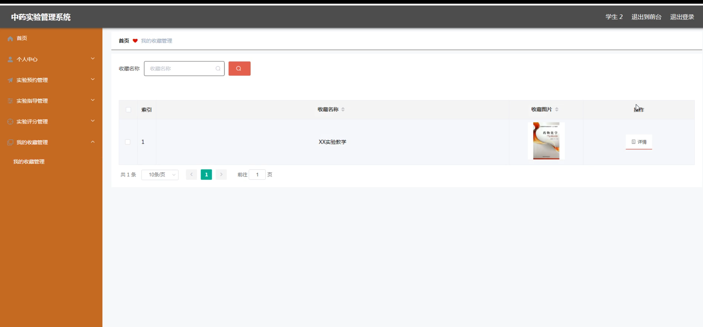

实验员端后台管理

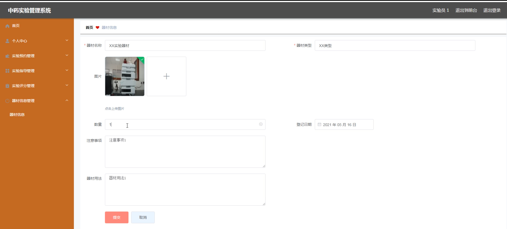

#### 总结

基于Spring Boot的中药实验管理系统通过整合实验教学、在线学习、实验预约和评分等功能，为中药学教学和实验提供了一个高效、便捷的管理平台。系统支持管理员、教师、实验员和学生四种角色，各角色具备相应的权限和功能模块，能够满足不同用户的需求和管理要求。系统通过科学的功能模块设计和高效的管理机制，提升了实验教学的效率和质量，促进了师生之间的互动和交流，保障了实验资源的充分利用，为中药学教育提供了强有力的支持。

#### 使用说明

创建数据库，执行数据库脚本 修改jdbc数据库连接参数 下载安装maven依赖jar 启动idea中的springboot项目

后台地址：http://localhost:8080/springboot3n829/admin/dist/index.html

管理员  abo 密码 abo

前台地址：http://localhost:8080/springboot3n829/front/index.html